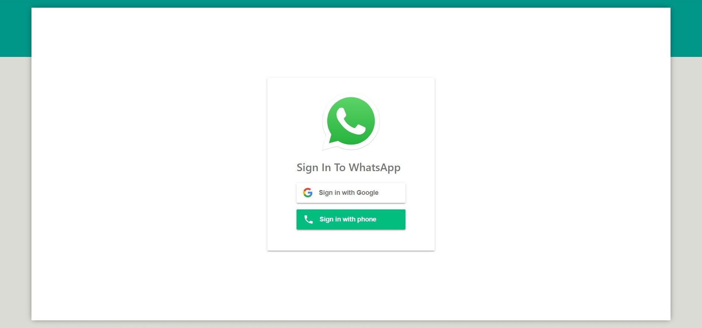
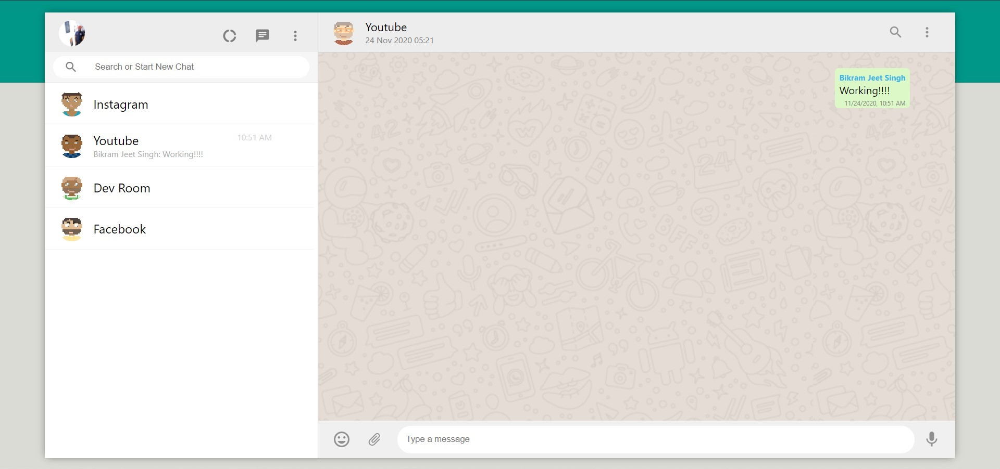

# WHATSAPP WEB ClONE

## Google and Phone Number Authentication

### WhatsApp Clone Login



### WhatsApp Clone Home



## Tech Used:

1. [Create React App](https://github.com/facebook/create-react-app) -- for creating the Template of the Project.
2. [Firebase](https://github.com/firebase) -- For Realtime Database and Deployment of the Project.
3. [react-router-dom](https://github.com/ReactTraining/react-router) -- For Routing Between Pages.
4. [material-ui](https://github.com/mui-org/material-ui) -- For Some PreBuilt Components and Icons.
5. [emoji-picker](https://github.com/ealush/emoji-picker-react#readme) -- For picking the emojees for the messaging.
6. [moment](https://momentjs.com/) -- for the time ago functionality.

## Installation

```
npm install
```

## Update Firebase Config File with your Firebase Config

## Start The App

```
npm start
```

## Build The Project

```
npm run build
```
